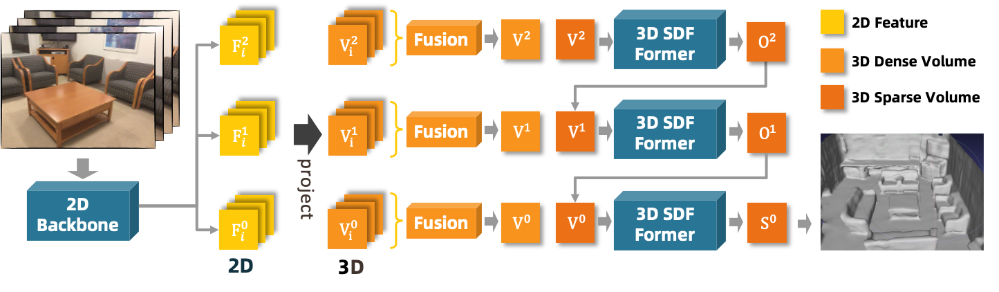
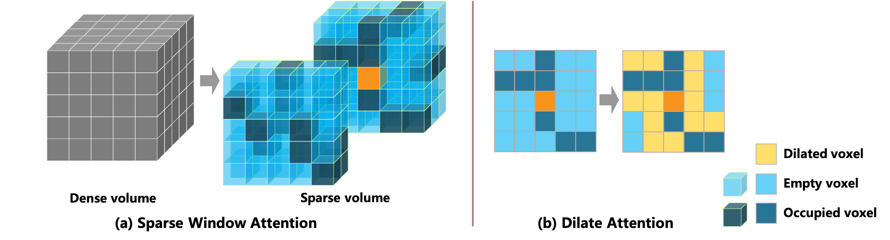

## 3D Former: Monocular Scene Reconstruction with SDF 3D Transformers

This is the official PyTorch implementation code for 3D-Former. For technical details, please refer to:

**3D Former: Monocular Scene Reconstruction with SDF 3D Transformers** <br />
Weihao Yuan, Xiaodong Gu, Heng Li, Zilong Dong, Siyu Zhu <br />
**ICLR 2023** <br />
**[[Project Page](https://weihaosky.github.io/former3d/)]** | 
**[[Paper](https://arxiv.org/abs/2301.13510)]** <br />


<p float="left">
  &emsp;&emsp; 
</p>
<p float="left">
  &emsp;&emsp; 
</p>

## Bibtex
If you find this code useful in your research, please cite:

```
@inproceedings{yuan2022former3d,
  title={3D Former: Monocular Scene Reconstruction with 3D SDF Transformers},
  author={Yuan, Weihao and Gu, Xiaodong and Li, Heng and Dong, Zilong and Zhu, Siyu},
  booktitle={Proceedings of the International Conference on Learning Representations},
  pages={},
  year={2023}
}
```

## Contents
1. [Installation](#installation)
2. [Datasets](#datasets)
3. [Training](#training)
4. [Evaluation](#evaluation)
5. [Model](#model)


## Installation
```bash
conda create -n former3d python=3.8
conda activate former3d

# Attention: The version of torchvision should be the same in training and inference. Mismatched version may generate strange results.
conda install pytorch-gpu=1.10.0 torchvision=0.9 cudatoolkit=11.1

pip install \
  pytorch-lightning==1.5 spconv-cu111==2.1.21 setuptools==59.5.0 scikit-image==0.18\
  numba pillow wandb tqdm pyyaml matplotlib black imageio easydict numpy_indexed \
  opencv-python open3d pyrender ray trimesh pycuda
  
pip install -e .
```

## Datasets

You can prepare the ScanNet data according to [here](https://github.com/noahstier/vortx#data), or download from [scannet](https://virutalbuy-public.oss-cn-hangzhou.aliyuncs.com/share/former3d/datasets/scannet_vortx.zip) and [tsdf](https://virutalbuy-public.oss-cn-hangzhou.aliyuncs.com/share/former3d/datasets/tsdf_vortx.zip).
Then modify the data path in the config files to your dataset locations.


## Training

```
python scripts/train.py --config config_localtest.yml --gpus 4
```


## Evaluation

First inference the meshes by
```
python scripts/inference.py --ckpt model.ckpt --outputdir results/test --split test --config config.yml --n-imgs 200 --cropsize 64
```
If the memory is not enough, you can reduce `n-imgs` with a small performance decrease.

Then evaluate the generated meshes by
```
MESA_GL_VERSION_OVERRIDE=4.1 python scripts/evaluate.py --results_dir results/test --split test --config config.yml --n_proc 0
```
Also, you can evaluate the meshes following [TransformerFusion](https://github.com/AljazBozic/TransformerFusion) to avoid penalizing more complete reconstruction.


## Model

| [Model](https://virutalbuy-public.oss-cn-hangzhou.aliyuncs.com/share/former3d/models/model.ckpt) | Acc. | Comp | Chamfer | Prec | Recall | F-score |
| :--- | :---: | :---: | :---: |  :---: |  :---: |  :---: |
| Evaluation 1  | 0.049 | 0.068 | 0.058 | 0.754 | 0.664 | 0.705 |
| Evaluation 2  | 0.032 | 0.062 | 0.047 | 0.829 | 0.694 | 0.754 |

The reconstructed meshes used for evaluation is available at [here](https://virutalbuy-public.oss-cn-hangzhou.aliyuncs.com/share/former3d/results/results.zip).


## Acknowledgements
Thanks to Stier Noah for opening source of the excellent work [VoRTX](https://github.com/noahstier/vortx).
Thanks to Jiageng Mao for opening source of the excellent work [VOTR](https://github.com/PointsCoder/VOTR).